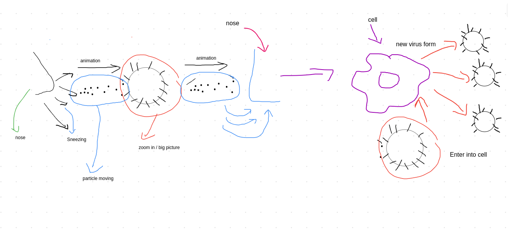

## low fidelity sketch

## references

1. https://threejs.org/docs/index.html#manual/en/introduction/Creating-a-scene
2. https://developer.mozilla.org/en-US/docs/Web/API/WebGL_API/Tutorial/Getting_started_with_WebGL

## youtube links

I. Three Js  
https://www.youtube.com/watch?v=6oFvqLfRnsU
https://www.youtube.com/watch?v=8jP4xpga6yY&t=491s
https://www.youtube.com/watch?v=tsMHONmUkvI
